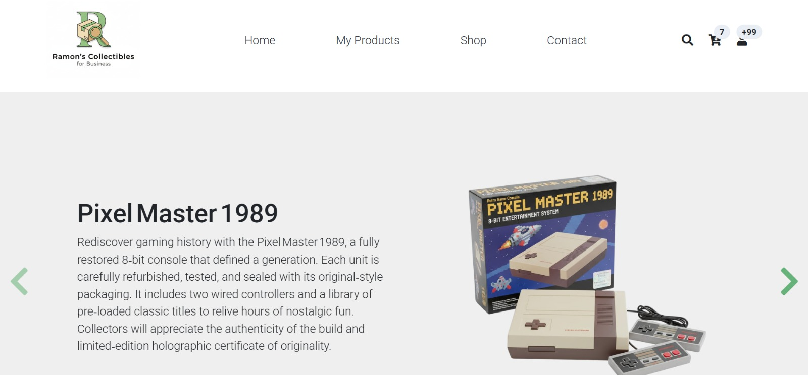
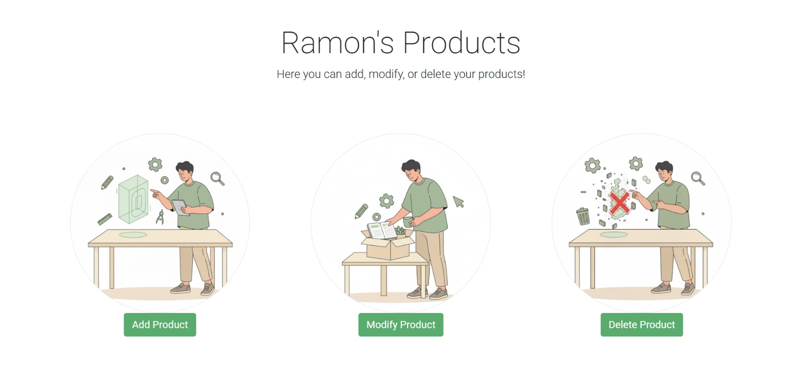
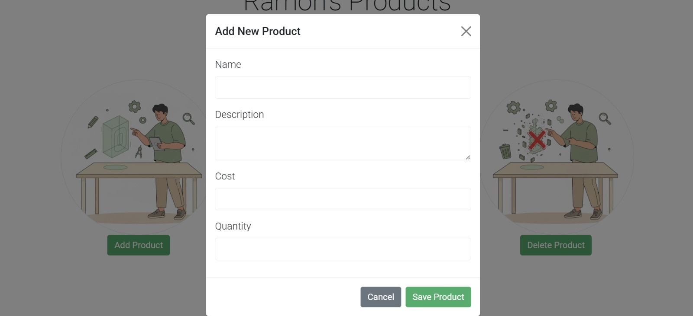
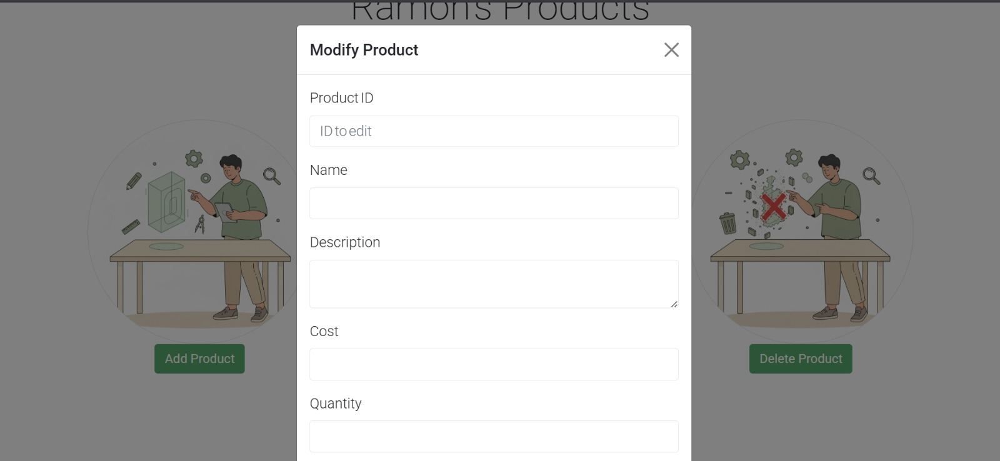
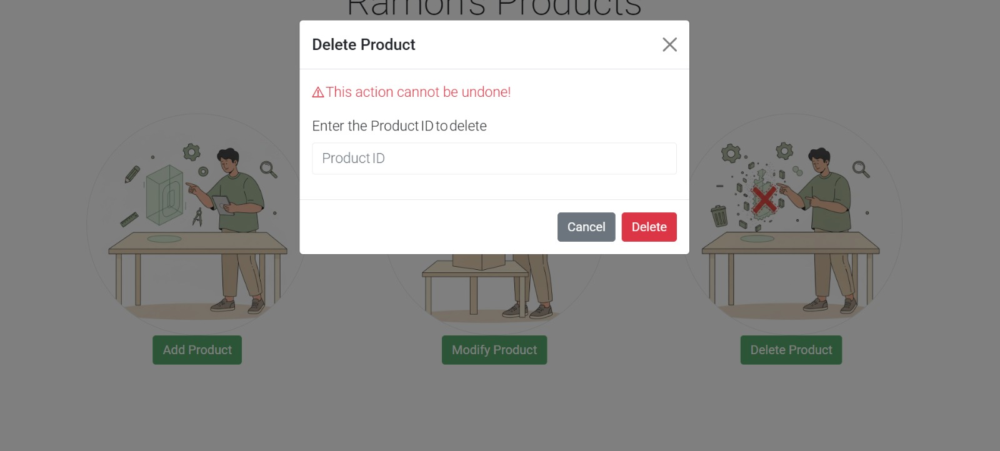
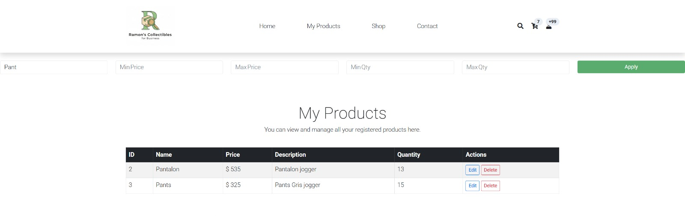
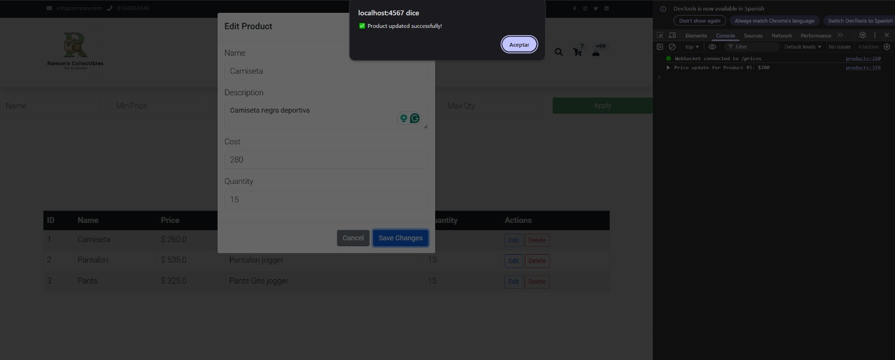

# 🚀 Java Spark Web Application

This project is a simple **web application** built using the **Java Spark Framework**.  
It allows users to **view**, **add**, **edit**, and **delete** products.  
It also includes a small **admin panel** and **database connection**.

---

## 📘 Table of Contents

* [📝 Description](#-description)
* [🧰 Technologies Used](#-technologies-used)
* [⚙️ Features](#%EF%B8%8F-features)
* [📦 Maven Configuration](#-maven-configuration)
* [🗂️ Project Structure](#-project-structure)
* [🚀 How to Run the Project](#-how-to-run-the-project)
* [🖼️ Screenshots](#-screenshots)
* [⚙️ Development Progress](#%EF%B8%8F-development-progress)
* [⚖️ License](#-license)

---

## 📝 Description

`Java_Spark_for_web_apps` is a simple **CRUD (Create, Read, Update, Delete)** web application that uses **Spark Java**, **Gson**, and **Mustache templates**.  
It connects to a database and allows basic product management through an interactive interface.

---

## 🧰 Technologies Used

* **Java 17+**
* **Spark Framework 2.9.4**
* **Gson 2.10.1**
* **Logback 1.2.11**
* **Mustache Templates**
* **HTML, CSS, JavaScript**
* **MySQL**

---

## ⚙️ Features

✅ **Product list displayed in a table view**  
✅ **Add new product**  
✅ **Edit existing product**  
✅ **Delete product**  
✅ **Admin panel for easy management**  
✅ **Modular and maintainable code structure**  
✅ **Database connectivity for persistent data**  
✅ **Item filtering for faster searches**  
✅ **Real-time price updates using WebSockets**

---

## 📦 Maven Configuration

The main dependencies used in the `pom.xml` file:

```xml
<dependencies>
    <dependency>
        <groupId>com.sparkjava</groupId>
        <artifactId>spark-core</artifactId>
        <version>2.9.4</version>
    </dependency>

    <dependency>
        <groupId>com.google.code.gson</groupId>
        <artifactId>gson</artifactId>
        <version>2.10.1</version>
    </dependency>

    <dependency>
        <groupId>ch.qos.logback</groupId>
        <artifactId>logback-classic</artifactId>
        <version>1.2.11</version>
    </dependency>
</dependencies>
```

---

## 🗂️ Project Structure
```bash

Java_Spark_for_web_apps/
├── DB/                     # Scripts SQL
├── src/
│   ├── main/
│   │   ├── java/
│   │   │   └── com/example/
│   │   │       ├── productapi/
│   │   │       │   ├── DBConnection.java
│   │   │       │   ├── ExceptionHandlerModule.java
│   │   │       │   ├── InvalidInputException.java
│   │   │       │   ├── Main.java
│   │   │       │   ├── Product.java
│   │   │       │   ├── ProductNotFoundException.java
│   │   │       │   └── ProductService.java
│   │   │       └── userapi/
│   │   └── resources/
│   │       ├── public/
│   │       │   ├── script.js
│   │       │   └── styles.css
│   │       └── templates/
│   │           ├── form.mustache
│   │           ├── index.mustache
│   │           ├── modals.mustache
│   │           ├── products.mustache
│   │           └── users.mustache
│   └── logback.xml
└── pom.xml
```
---

## 🚀 How to Run the Project

1. **Install Java 17+ and Maven.**
2. **Clone the repository:**
   ```bash
   git clone https://github.com/yourusername/Java_Spark_for_web_apps.git
Navigate to the project folder:

bash
Copy code
cd Java_Spark_for_web_apps
Build and run the project:

bash
Copy code
mvn clean install
mvn exec:java -Dexec.mainClass="com.example.productapi.Main"
Open your browser and go to:
http://localhost:4567

## 🖼️ Screenshots
Here are some screenshots showing the application in action:

🏠 Home Page


⚙️ Admin Panel

📋 Product Table View (CRUD)

➕ Add Product Modal

✏️ Edit Product Modal

❌ Delete Product Modal

🔍 Item Filters Implemented

💲 Real-Time Price Update Feature

## ⚙️ Development Progress
✅ Completed Tasks
🧩 From Previous Sprints:
Full CRUD operations — users can easily create, read, update, and delete products through the web interface.

Integration of Mustache templates for dynamic HTML rendering.

Exception handling module for structured error management.

Logback configuration for server-side logging.

Admin panel added for intuitive system management.

Database connection established through DBConnection.java.

## 🚀 Recent Improvements:
✅ Checklist validation — ensured all required functionalities and quality criteria were verified before finalizing development.

🔍 Item filters implemented — users can now search or filter products quickly within the table.

💲 Real-time price update logic — added WebSocket functionality for instant price modifications without page reload.

🧩 Code Updates and Modular Enhancements:
Added filtering logic to ProductService class.

Integrated a WebSocket endpoint for real-time communication.

Updated frontend logic to dynamically reflect live updates.

📤 GitHub repository updated — includes full source code, new features, and stable deliverables for this phase.

## ⚖️ License
This project is open-source software.
You are free to use, modify, and share it for learning and development purposes.

## 📚 Made with ❤️ using Java Spark Framework 
  